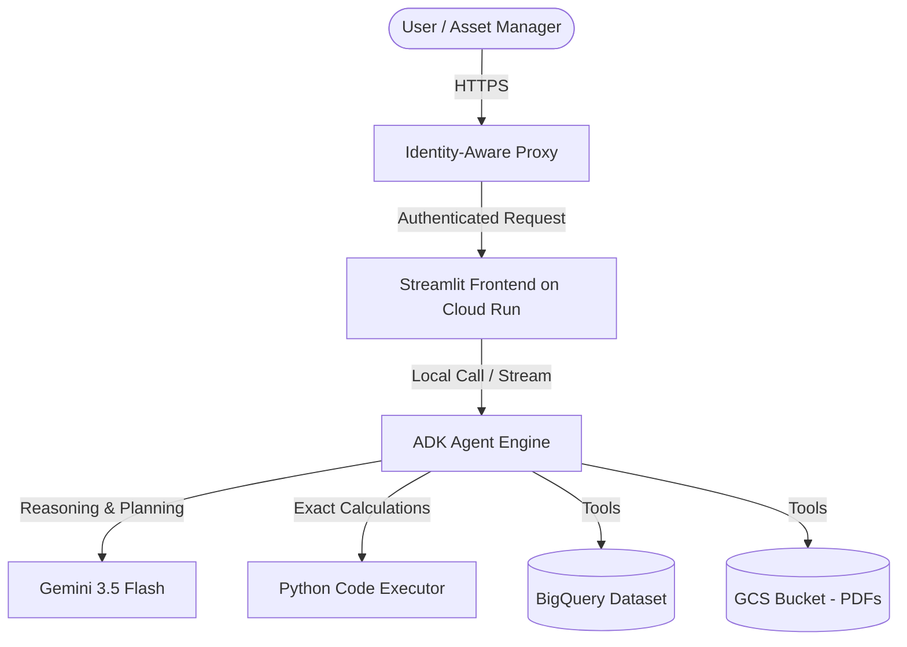

# Vornado Penn District Lease Optimizer

An Asset Management and Revenue Optimization Co-pilot for commercial real estate trusts. This solution leverages the **Agent Development Kit (ADK)** to build a reasoning agent that parses unstructured lease agreements, queries structured financial/market databases, and performs exact calculations via a sandboxed Python code executor.

It includes an interactive **Streamlit web dashboard** showing 5 core executive scenarios with Plotly visualisations, fully deployable to **Cloud Run** and secured with **Identity-Aware Proxy (IAP)**.

---

## 🏗️ Architecture Overview

The solution consists of three main components:
1. **The AI Agent (Agent Runtime):** Orchestrated with ADK, utilizing `gemini-3.5-flash` and custom tools to query BigQuery and GCS.
2. **The Frontend Web UI (Cloud Run):** Streamlit interface for scenario-based interactions and data visualization.
3. **Data Stores (GCP):** Google Cloud Storage (GCS) for unstructured documents and BigQuery (BQ) for structured tabular datasets.

### System Architecture Flow



---

## 📊 Test Data Structure

The demo analyzes a mock commercial real estate portfolio (focused on Vornado's Penn District redevelopment) using the following data model:

### 1. Unstructured Documents (Stored in GCS)
* **`PENN2_Apex_Fintech_Draft_Lease.pdf`**: A draft lease agreement containing complex legal terms (force majeure, rent concessions, and delivery delay penalty rules).
* **`PENN1_BioMed_Diagnostics_Draft_Lease.pdf`**: Companion lease draft.
* **`PENN2_Construction_Status_Report.pdf`**: Architect's report detailing the construction schedule, milestones, and delays.

### 2. Structured Datasets (Stored in BigQuery)

| Table Name | Description | Key Fields |
|---|---|---|
| `historical_leases` | Historical executed leases for benchmarking terms. | `property_name`, `base_rent_per_rsf`, `free_rent_months`, `ti_allowance_per_rsf` |
| `construction_costs_ti` | Real-time and historical TI costs and contractor delays. | `contractor_name`, `delay_days`, `budgeted_cost_per_rsf`, `actual_cost_per_rsf` |
| `market_comps` | Local submarket transaction comps. | `property_name`, `submarket`, `base_rent_per_rsf`, `ti_allowance_per_rsf` |
| `tax_escalations` | Historical real estate taxes and operating expenses. | `property_name`, `year`, `real_estate_tax_per_rsf`, `operating_expense_per_rsf` |

---

## 🛠️ Environment Variables

Before starting, define these environment variables to customize your project:

```bash
export GOOGLE_CLOUD_PROJECT="your-gcp-project-id"
export GCS_BUCKET="your-gcs-bucket-name"
export BQ_DATASET="your_bigquery_dataset_name"
export REGION="us-central1"
export USER_EMAIL="user@yourdomain.com"
```

---

## 🚀 Step-by-Step Setup & Deployment

### Step 1: Clone and Set Up Local Workstation

1. **Install Prerequisites:**
   * Python `3.11` or `3.12`
   * `uv` (Fast Python Package Installer and resolver)
   * Google Cloud SDK (`gcloud` CLI)

2. **Authenticate with GCP:**
   ```bash
   gcloud auth login
   gcloud auth application-default login
   ```

3. **Install Dependencies:**
   Navigate to the `lease-optimizer` subdirectory and run:
   ```bash
   uv sync
   ```

---

### Step 2: Deploy the Test Data

1. **Upload PDFs to GCS:**
   Run the utility script to create the GCS bucket and upload files:
   ```bash
   python scripts/upload_to_gcs.py --project $GOOGLE_CLOUD_PROJECT --bucket $GCS_BUCKET
   ```

2. **Load Structured Datasets into BigQuery:**
   Create the tables and load CSV records into BigQuery:
   ```bash
   python scripts/load_to_bigquery.py --project $GOOGLE_CLOUD_PROJECT --dataset $BQ_DATASET
   ```

---

### Step 3: Deploy the Agent to Agent Runtime

Deploy the ADK agent engine to Vertex AI Agent Engine (Reasoning Engine):

```bash
cd lease-optimizer
agents-cli deploy \
  --project $GOOGLE_CLOUD_PROJECT \
  --region $REGION \
  --no-confirm-project
```

Once deployment finishes, it will print the **Agent Runtime ID** (e.g. `projects/PROJECT_NUMBER/locations/REGION/reasoningEngines/ENGINE_ID`).

---

### Step 4: Build & Deploy Frontend to Cloud Run

1. **Submit Build to Cloud Build:**
   Build the container image using the root Dockerfile:
   ```bash
   gcloud builds submit \
     --tag gcr.io/$GOOGLE_CLOUD_PROJECT/lease-optimizer-frontend:latest \
     --project $GOOGLE_CLOUD_PROJECT
   ```

2. **Deploy to Cloud Run with IAP Enabled:**
   Deploy the built image to Cloud Run:
   ```bash
   gcloud run deploy lease-optimizer-frontend \
     --image gcr.io/$GOOGLE_CLOUD_PROJECT/lease-optimizer-frontend:latest \
     --region $REGION \
     --project $GOOGLE_CLOUD_PROJECT \
     --no-allow-unauthenticated \
     --iap
   ```
   Take note of the returned **Service URL** and **Project Number**.

---

### Step 5: Secure Frontend with Identity-Aware Proxy (IAP)

1. **Authorize IAP Service Agent to Invoke Cloud Run:**
   ```bash
   gcloud run services add-iam-policy-binding lease-optimizer-frontend \
     --region $REGION \
     --project $GOOGLE_CLOUD_PROJECT \
     --member="serviceAccount:service-PROJECT_NUMBER@gcp-sa-iap.iam.gserviceaccount.com" \
     --role="roles/run.invoker"
   ```

2. **Grant Access to users:**
   Add users or groups to the IAP Access policy:
   ```bash
   gcloud iap web add-iam-policy-binding \
     --project $GOOGLE_CLOUD_PROJECT \
     --resource-type=cloud-run \
     --service=lease-optimizer-frontend \
     --region $REGION \
     --member="user:$USER_EMAIL" \
     --role="roles/iap.httpsResourceAccessor"
   ```

---

## 💡 Usage & Scenario Walkthroughs

Once deployed and authenticated, access the dashboard URL in your browser. You can explore these 5 preset asset management workflows:

1. **Cash NOI Inflection & Slippage:** Run analysis to see how construction delays in PENN 2 shift the GAAP vs. Cash NOI crossover calendar.
2. **Concession & Penalty Liability Audit:** Calculate financial rent abatements (1-for-1 or 2-for-1 days of free rent) triggered by contractor delays.
3. **Contractor Risk & Budget Overrun:** Synthesize a risk audit of current GCs (e.g., Turner Construction) by checking historical cost overruns.
4. **Market Benchmarking:** Benchmark proposed base rent and TI allowances against local Penn District submarket averages.
5. **Rent Escalation Forecasting:** Project opex and tax billings based on tenant proportionate share and base year growth caps.
