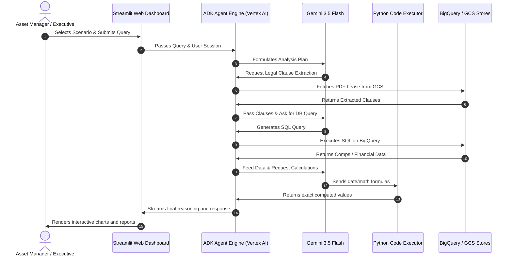
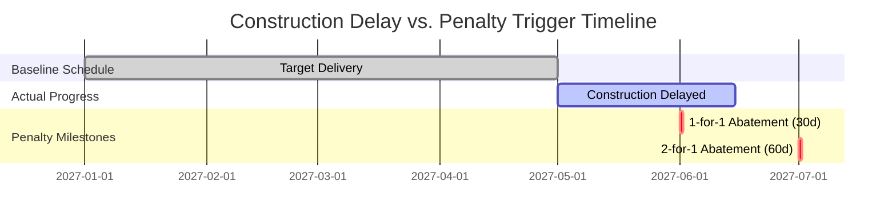

# Introducing the AI Real Estate Asset Optimizer: A Game-Changer for Commercial Portfolios

In the fast-moving world of commercial real estate, asset management has traditionally been a game of two halves: legal and financial. 

On one hand, you have massive, hundred-page lease agreements full of legal clauses, force majeure provisions, and complex penalty structures. On the other, you have financial databases tracking rents, comps, construction budgets, and tax history. Bridge the gap between these two worlds has historically required weeks of manual analysis, legal reviews, and spreadsheet modeling—often leading to delayed decisions, missed revenue opportunities, or unmitigated risks.

Today, we are introducing the **AI Real Estate Asset Optimizer Co-pilot**, built using Google's advanced **Agent Development Kit (ADK)** and powered by **Gemini 3.5 Flash**. 

This solution is designed for real estate investment trust (REIT) and asset management executives to instantly bridge the gap between legal contracts and financial datasets, transforming how commercial property portfolios are managed.

---

## 🏗️ System Architecture: The Intelligence Behind the Decisions

The AI Asset Optimizer is not just a chat interface. It is an agentic RAG (Retrieval-Augmented Generation) pipeline that combines unstructured document intelligence with structured database querying and exact mathematical execution.

### Component Topology

### Execution Flow Sequence

### Why this is a technological leap:
* **Hybrid Data Querying:** The agent seamlessly combines unstructured documents (PDF draft leases and architect schedule reports) with structured relational tables (comps, taxes, construction costs).
* **Zero-Hallucination Math:** LLMs are notoriously bad at precise date math and financial calculations. The Optimizer solves this by routing formulas to a **sandboxed Python Code Executor** to compute exact values before returning answers.
* **Secured by Design:** The entire visual frontend is hosted on Google Cloud and wrapped in **Identity-Aware Proxy (IAP)**, ensuring that only authenticated stakeholders can access sensitive portfolio data.

---

## 💡 Core Business Scenarios: Transforming Portfolios

Here is how the AI Asset Optimizer handles five critical business storylines to protect and grow Net Operating Income (NOI):

### 1. Cash NOI Inflection & Slippage (CFO Focus)
* **The Challenge:** When a general contractor delays floor delivery, how does that shift the crossover calendar between GAAP straight-line revenue and actual cash flow?
* **The AI Solution:** The agent extracts delivery milestones from construction status reports and translates legal lease clauses (Section 14 Tenant Improvement Allowance rules) to map the exact month Vornado begins collecting base rent, projecting cash slippage automatically.

### 2. Concession & Penalty Liability Audit (AM Focus)
* **The Challenge:** Leases often include complex tiered penalty structures (e.g., if delivery is delayed over 30 days, the tenant receives 1-for-1 rent abatement; if over 60 days, 2-for-1 abatement).
* **The AI Solution:** The agent parses the draft lease to find the exact penalty triggers, matches it with the current project status report to calculate construction delay days, and multiplies it by the base rent rate to project Vornado's total cash exposure.

### 3. Contractor Risk & Budget Overrun (COO Focus)
* **The Challenge:** How do you assess contractor reliability and budget risk before signing new project agreements?
* **The AI Solution:** The agent runs comparative analytics across historical project tables in BigQuery, benchmarking current contractor timelines and cost variances against historical performance to identify risk profiles.

### 4. Market Benchmarking (AM Focus)
* **The Challenge:** Determining Vornado's premium positioning in the Penn District submarket during draft negotiations.
* **The AI Solution:** The agent queries local submarket comps in real-time, calculating averages for base rents, concessions, and TI allowances, and benchmarks the draft terms against the market to ensure Vornado captures maximum value.

### 5. Rent Escalation Forecasting (CFO Focus)
* **The Challenge:** Projecting operating expense (opex) and tax escalation billings for upcoming years.
* **The AI Solution:** The agent reads proportionate share clauses and base year indices from Section 22 of the lease, retrieves historical expense history, and calculates projected tenant billings with caps and growth constraints factored in.

---

## 🚀 The Business Case: Why It's a Game-Changer

### ⚡ Accelerated Deal Cycles
Instead of waiting days for analysts to manually cross-reference legal drafts and financial spreadsheets, lease negotiators can query the co-pilot in seconds to understand the financial impact of changing clauses.

### 🛡️ Leakage and Liability Prevention
By auditing delivery delays against contract penalty clauses in real-time, asset managers can proactively negotiate extensions, manage contractor accountability, and prevent costly rent abatement penalties.

### 📈 Data-Driven Negotiation Leverage
Instantly benchmark proposed lease terms against real-time submarket comps and historical contractor timelines. Negotiate from a position of absolute data certainty.

### 🔮 Accurate Cash Flow Forecasting
Understand exactly when straight-line GAAP revenue translates into actual cash in the bank, and project the long-term impact of escalations and caps.

---

*The AI Real Estate Asset Optimizer represents the future of commercial portfolio intelligence—where legal constraints and financial data work in perfect harmony.*
