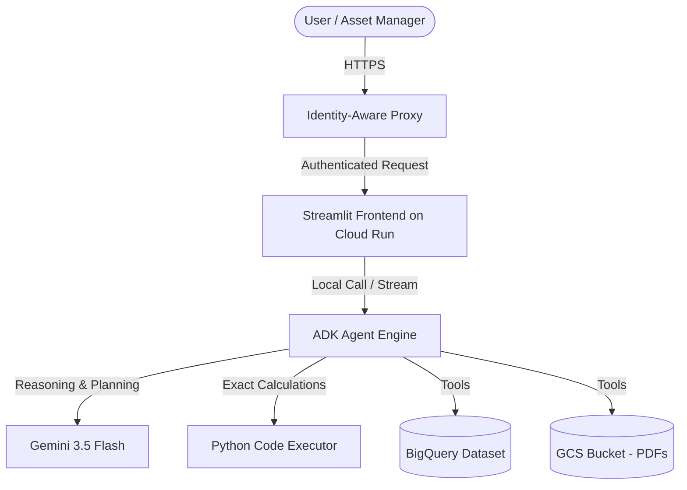
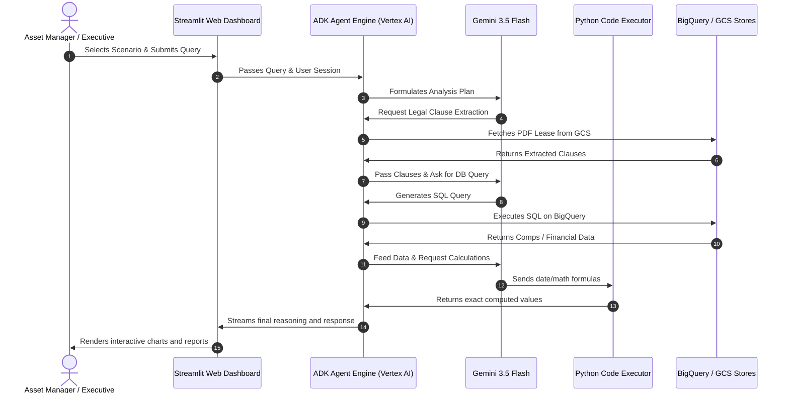
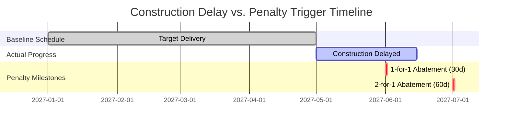
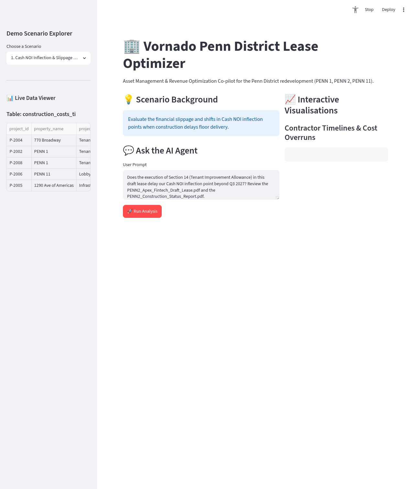
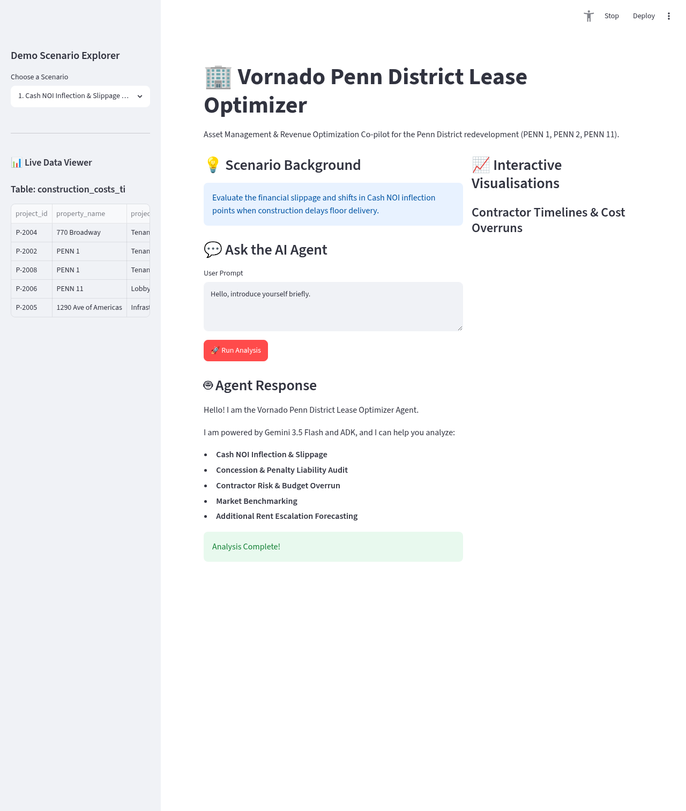

# Introducing the AI Real Estate Asset Optimizer for Commercial Portfolios

In the commercial real estate industry, asset management has traditionally been split between legal and financial workflows.

On one hand, there are long lease agreements containing complex legal clauses, force majeure provisions, and penalty structures. On the other hand, there are financial databases tracking rents, comps, construction budgets, and tax history. Bridging the gap between these two data sources has historically required manual analysis, legal reviews, and spreadsheet modeling—often leading to delayed decisions, missed revenue opportunities, or unmitigated risks.

Today, we are introducing the **AI Real Estate Asset Optimizer Co-pilot**, built using Google's **Agent Development Kit (ADK)** and powered by **Gemini 3.5 Flash**.

This solution is designed to help real estate investment trust (REIT) and asset management executives integrate legal contracts and financial datasets to optimize how commercial property portfolios are managed.

---

## 🏗️ System Architecture: The Intelligence Behind the Decisions

The AI Asset Optimizer is an agentic RAG (Retrieval-Augmented Generation) pipeline that combines unstructured document intelligence with structured database querying and exact mathematical execution.

### Component Topology



### Execution Flow Sequence



### Key Technical Advantages:
* **Hybrid Data Querying:** The agent combines unstructured documents (PDF draft leases and architect schedule reports) with structured relational tables (comps, taxes, construction costs).
* **Code-Executed Math:** LLMs can exhibit inaccuracies with precise date math and financial calculations. The Optimizer resolves this by routing formulas to a **sandboxed Python Code Executor** to compute exact values before returning answers.
* **Secured by Design:** The visual frontend is hosted on Google Cloud and wrapped in **Identity-Aware Proxy (IAP)**, ensuring that only authenticated stakeholders can access sensitive portfolio data.

---

## 💡 Core Business Scenarios: Optimizing Portfolio Workflows

Here is how the AI Asset Optimizer handles five critical business storylines to protect and project Net Operating Income (NOI):

### 1. Cash NOI Inflection & Slippage (CFO Focus)
* **The Challenge:** When a contractor delays floor delivery, how does that shift the crossover calendar between GAAP straight-line revenue and actual cash flow?
* **The AI Solution:** The agent extracts delivery milestones from construction status reports and translates legal lease clauses (Section 14 Tenant Improvement Allowance rules) to map the exact month rent collection begins, projecting cash slippage.

### 2. Concession & Penalty Liability Audit (AM Focus)
* **The Challenge:** Leases often include complex tiered penalty structures (e.g., if delivery is delayed over 30 days, the tenant receives 1-for-1 rent abatement; if over 60 days, 2-for-1 abatement).
* **The AI Solution:** The agent parses the draft lease to find the exact penalty triggers, matches it with the current project status report to calculate construction delay days, and multiplies it by the base rent rate to project total cash exposure.

### 3. Contractor Risk & Budget Overrun (COO Focus)
* **The Challenge:** How do you assess contractor reliability and budget risk before signing new project agreements?
* **The AI Solution:** The agent runs comparative analytics across historical project tables in BigQuery, benchmarking current contractor timelines and cost variances against historical performance to identify risk profiles.



### 4. Market Benchmarking (AM Focus)
* **The Challenge:** Determining premium positioning in the local submarket during draft negotiations.
* **The AI Solution:** The agent queries local submarket comps in real-time, calculating averages for base rents, concessions, and TI allowances, and benchmarks the draft terms against the market to support Vornado's negotiation positioning.

### 5. Rent Escalation Forecasting (CFO Focus)
* **The Challenge:** Projecting operating expense (opex) and tax escalation billings for upcoming years.
* **The AI Solution:** The agent reads proportionate share clauses and base year indices from Section 22 of the lease, retrieves historical expense history, and calculates projected tenant billings with caps and growth constraints factored in.

---

## 🖥️ User Interface: Streamlit Dashboard Walkthrough

The visual workspace brings the agent's multi-modal intelligence directly to portfolio managers, dividing the layout between data exploration, natural language queries, and visual analytics.

````carousel

<!-- slide -->

````

### Detailed Walkthrough of the User Interface

To understand the operational flow, we examine the dashboard layout across its two primary execution phases: the initial setup and the post-analysis output.

#### 1. Baseline State (Before Running)


The baseline interface presents the asset manager with a clean, structured workspace organized into three primary columns:
*   **Interactive Scenario Sidebar (Left Panel):** Features a **Demo Scenario Explorer** dropdown selector to choose one of the five core business scenarios. Directly underneath, the **Live Data Viewer** table drawer automatically updates to render the schema and initial raw records (e.g., showing columns like `project_id`, `property_name`, `project_type` for the active table `construction_costs_ti`) from the connected BigQuery database.
*   **Query and Prompt Configuration (Center Workspace):** Displays the selected scenario's context under **Scenario Background**. The **Ask the AI Agent** text area pre-populates with a recommended query (e.g., referencing specific files like `PENN2_Apex_Fintech_Draft_Lease.pdf` and `PENN2_Construction_Status_Report.pdf` and requesting an analysis of Section 14 tenant improvement milestones). A red **Run Analysis** action button is positioned at the bottom of the section.
*   **Plotly Visualisation Canvas (Right Panel):** Houses the **Interactive Visualisations** canvas. In this baseline state, the panel displays blank grey skeleton placeholders (e.g., underneath "Contractor Timelines & Cost Overruns"), indicating where final analytical plots, Gantt charts, or cost distributions will render upon execution.

#### 2. Execution State (After Co-pilot Completes)


Upon clicking **Run Analysis**, the co-pilot executes the query and dynamically updates the workspace:
*   **Streaming Agent Reasoning:** A dedicated **Agent Response** pane expands beneath the prompt input block. It streams the agent's multi-step planning, listing the generated BigQuery SQL SELECT queries, parsed lease provisions, and Python sandbox executions in real time.
*   **Success Alert Banner:** A green success banner displaying "Analysis Complete!" is displayed at the bottom of the agent response, confirming successful execution.
*   **Formatted Markdown Tables:** Main workspace outputs, such as monthly cash flow inflections, penalty abatement calculations, or market comp ranges, are rendered as structured, read-only markdown tables in the central chat pane.
*   **Filled Plotly Dashboards:** The right-hand panel's skeleton placeholders are replaced with high-fidelity, interactive visualizations, including Gantt charts tracking construction delays against contractual penalty triggers, contractor cost variance plots, or historical opex trends.

---

## 📊 Mock Test Data Structure: Grounding Agent Decisions

The AI Asset Optimizer relies on a multi-modal mock data architecture, integrating unstructured contract documents in Google Cloud Storage with structured operational records in BigQuery. This allows the co-pilot to audit draft contracts by cross-referencing them against actual historical and market data.

### 📁 Unstructured Documents (Google Cloud Storage)
Unstructured documents are stored in the GCS bucket `vornado-leases-genaillentsearch` and contain the legal parameters and real-time project updates:
*   `PENN1_BioMed_Diagnostics_Draft_Lease.pdf`: A draft lease agreement for BioMed Diagnostics at PENN 1. It details starting base rent schedules, tenant improvement (TI) allowance terms, and commencement milestones.
*   `PENN2_Apex_Fintech_Draft_Lease.pdf`: A draft lease agreement for Apex Fintech at PENN 2. It contains legal provisions regarding base rent rates, late delivery penalty/abatement schedules (e.g., Section 14 and Section 3.3), and base year opex definitions.
*   `PENN2_Construction_Status_Report.pdf`: A progress update from the general contractor outlining targeted versus actual delivery dates, project delays, and specific causes of delay (e.g., HVAC units lead times).

### 🗄️ Structured Datasets (BigQuery)
Structured tables are stored under the BigQuery dataset `genaillentsearch.vornado_realestate` and provide historical portfolio metrics and local submarket benchmarks:

#### 1. `historical_leases`
*   **Purpose**: Tracks historical lease executions across Vornado's portfolio to enable baseline rent, lease term, and incentive benchmarking.
*   **Schema**:
    *   `lease_id` (STRING): Unique identifier for the historical lease.
    *   `property_name` (STRING): Vornado property name (e.g. PENN 1, PENN 2).
    *   `tenant_name` (STRING): Name of the tenant.
    *   `execution_date` (DATE): Date the lease agreement was signed.
    *   `commencement_date` (DATE): Date the lease term officially commenced.
    *   `lease_term_months` (INT64): Total length of the lease in months.
    *   `rsf` (INT64): Rentable square feet leased.
    *   `initial_base_rent_per_rsf` (NUMERIC): Starting base rent rate per RSF per year.
    *   `free_rent_months` (INT64): Number of months of base rent abatement.
    *   `ti_allowance_per_rsf` (NUMERIC): Tenant Improvement allowance provided per RSF.
    *   `step_up_percentage` (NUMERIC): Percentage increase during rent step-ups.
    *   `step_up_interval_months` (INT64): Number of months between rent step-ups.
    *   `industry` (STRING): Tenant industry vertical.
    *   `lease_status` (STRING): Current status (Active, Expired, Terminated).

#### 2. `construction_costs_ti`
*   **Purpose**: Tracks budget, timeline, and actual construction performance across various contractors to audit construction delays and contractor delivery risks.
*   **Schema**:
    *   `project_id` (STRING): Unique identifier for the construction project.
    *   `property_name` (STRING): Vornado property name.
    *   `project_type` (STRING): Type of project (e.g. Tenant Fit-Out, Lobby Redevelopment).
    *   `contractor_name` (STRING): Name of the general contractor.
    *   `start_date` (DATE): Project start date.
    *   `completion_date` (DATE): Project actual or projected completion date.
    *   `budgeted_cost_per_rsf` (NUMERIC): Underwritten or budgeted cost per RSF.
    *   `actual_cost_per_rsf` (NUMERIC): Actual cost incurred per RSF.
    *   `delay_days` (INT64): Number of calendar days of delay.
    *   `reason_for_delay` (STRING): Primary driver of construction delay.

#### 3. `market_comps`
*   **Purpose**: Houses comparable transaction records from external brokerages within local submarkets to evaluate negotiation terms.
*   **Schema**:
    *   `comp_id` (STRING): Unique identifier for the market comparison record.
    *   `property_name` (STRING): Name of the comp property.
    *   `submarket` (STRING): Submarket classification (e.g. Penn District, Midtown West).
    *   `execution_date` (DATE): Date the lease comp was executed.
    *   `rsf` (INT64): Rentable square feet of the comp lease.
    *   `lease_term_months` (INT64): Lease term in months.
    *   `base_rent_per_rsf` (NUMERIC): Base rent per RSF per year.
    *   `free_rent_months` (INT64): Number of months of rent abatement.
    *   `ti_allowance_per_rsf` (NUMERIC): TI allowance per RSF.
    *   `source` (STRING): Brokerage source of the data (JLL, CBRE, Cushman).

#### 4. `tax_escalations`
*   **Purpose**: Contains historical real estate tax and operating expense (opex) records per RSF alongside baseline base-year configurations. Used to model opex/tax escalation forecasting and cap compliance.
*   **Schema**:
    *   `property_name` (STRING): Vornado property name.
    *   `year` (INT64): Calendar year of tax or expense assessment.
    *   `real_estate_tax_per_rsf` (NUMERIC): Real estate tax rate per RSF.
    *   `operating_expense_per_rsf` (NUMERIC): Operating expense rate per RSF.
    *   `base_year_tax` (NUMERIC): Base year real estate tax rate per RSF for escalations.
    *   `base_year_opex` (NUMERIC): Base year operating expense rate per RSF for escalations.

### 🔄 Data Cross-Referencing & Audit Workflow
To execute a lease audit, the agent performs a coordinated 4-step pipeline:
1.  **Extract Contract Rules:** The agent parses the lease PDF (from GCS) to extract key contract metrics (e.g., target delivery dates, opex caps, base year, and penalty triggers).
2.  **Fetch Operational Realities:** The agent queries BigQuery tables to retrieve corresponding performance metrics (e.g., actual construction completion dates in `construction_costs_ti` or historical tax rates in `tax_escalations`).
3.  **Execute calculations in Sandbox:** The extracted contract parameters and raw database rows are passed to the sandboxed Python Code Executor to perform precise date differences, penalty multipliers, or opex cap compounding.
4.  **Produce Audit Summary:** The final validated outputs are formatted into clear markdown summaries and interactive dashboards.

#### Concrete Scenario Workflows:
*   **Cash NOI Inflection & Delay Penalty Audits**: The agent reads the draft lease agreement (`PENN2_Apex_Fintech_Draft_Lease.pdf`) to extract rent abatement triggers and penalty rules (e.g., Section 3.3). It then queries the construction status report (`PENN2_Construction_Status_Report.pdf`) or the `construction_costs_ti` table to obtain actual contractor delays (e.g., 44 delay days on PENN 2). Using this data, the agent computes the exact cash flow slippage and penalty exposure (e.g., number of 1-for-1 and 2-for-1 rent abatement days) via the Python Code Executor.
*   **Contractor Risk Audits**: The agent combines the contractor named in the construction status report with historical performance data from the `construction_costs_ti` table in BigQuery. It runs aggregation queries to compute historical average delay days and budget overruns for that contractor (e.g., Turner Construction), evaluating project completion risk.
*   **Market Benchmarking**: The agent parses proposed base rent, free rent, and TI allowances from the draft lease PDF. It then runs a SQL query on the `market_comps` table to pull comparable transactions in the same submarket (e.g., Penn District) and calculates the average base rent and TI allowance to benchmark the competitiveness of the draft.
*   **Escalation Forecasting**: The agent reads the proportionate share percentage, base year, and growth cap clauses from the draft lease. It then pulls historical tax/opex data from the `tax_escalations` table to calculate base year vs. subsequent year variances, applying caps and ratios to forecast future tenant billings.

---

## 🚀 Business Value Proposition

### ⚡ Accelerated Deal Cycles
Instead of waiting days for analysts to manually cross-reference legal drafts and financial spreadsheets, lease negotiators can query the co-pilot in seconds to understand the financial impact of changing clauses.

### 🛡️ Leakage and Liability Prevention
By auditing delivery delays against contract penalty clauses in real-time, asset managers can proactively negotiate extensions, manage contractor accountability, and manage rent abatement risk.

### 📈 Data-Driven Negotiation Leverage
Instantly benchmark proposed lease terms against real-time submarket comps and historical contractor timelines. Negotiate with comprehensive, data-backed insights.

### 🔮 Accurate Cash Flow Forecasting
Understand exactly when straight-line GAAP revenue translates into actual cash in the bank, and project the long-term impact of escalations and caps.

---

*The AI Real Estate Asset Optimizer integrates legal constraints and financial data to streamline commercial portfolio management.*
